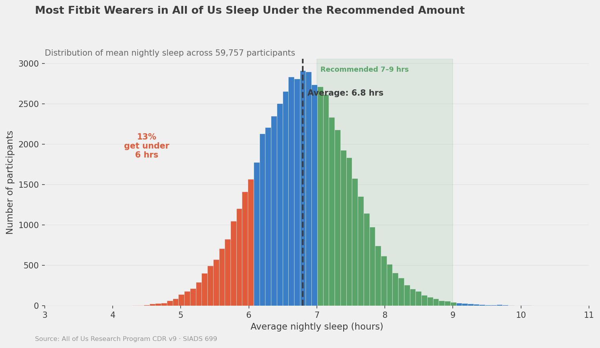
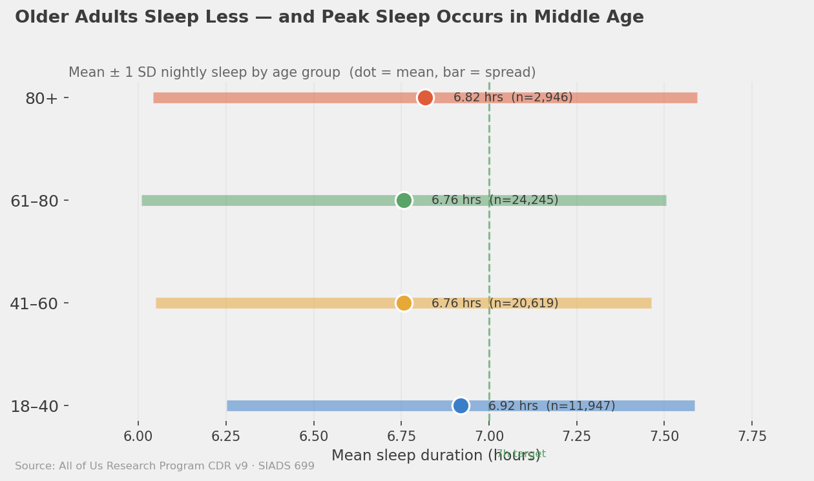
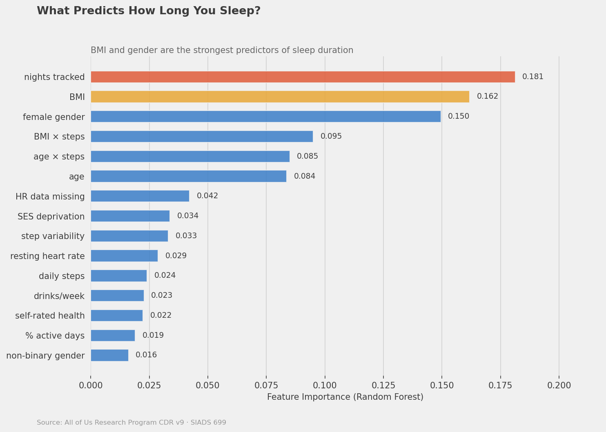
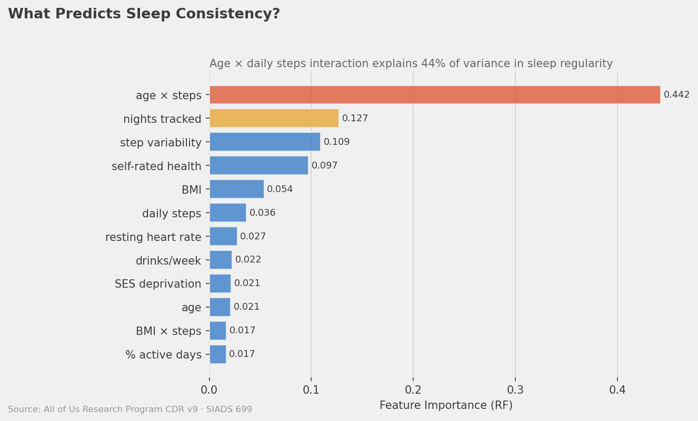
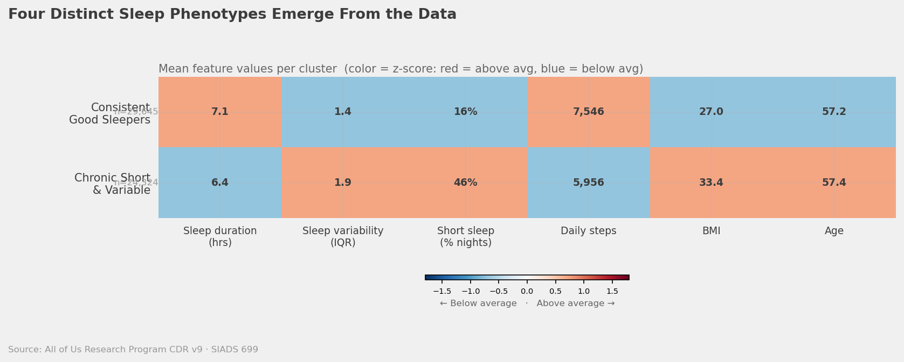
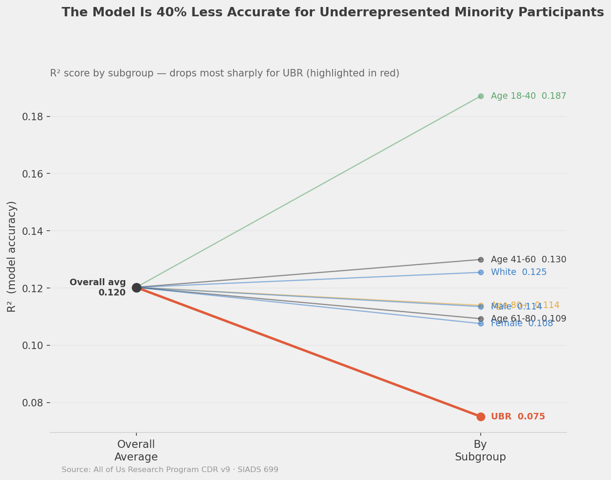

# Predicting and Phenotyping Sleep Health in a Diverse National Cohort: Evidence from the *All of Us* Research Program

**Sophia Boettcher, Auston Balwinski, Hunter Belous, Jared Fox**  
School of Information, University of Michigan  
SIADS 699 Capstone Project — July 2026

---

## Abstract

Sleep health is a critical but underexplored determinant of population health, particularly in racially and socioeconomically diverse cohorts. Using wearable-derived sleep data from 59,757 participants in the *All of Us* Research Program (CDR v9), we built a two-phase machine learning pipeline to predict individual sleep duration and sleep consistency (intraindividual variability). Phase 1 linear models (Ridge, Lasso, ElasticNet) established baselines of R² = 0.085 (duration) and R² = 0.159 (consistency). Phase 2 ensemble models, including Random Forest and Histogram Gradient Boosting Machines (HistGBM), improved these to R² = 0.099 and R² = 0.184 respectively — a +16% relative gain. Feature importance analysis revealed BMI, gender, and tracking engagement as primary duration predictors, while a novel age×steps interaction term dominated consistency prediction. Unsupervised KMeans clustering (k=4) identified four behaviorally distinct phenotypes. Critically, fairness analysis uncovered a 40% R² gap between White and Underrepresented in Biomedical Research (UBR) participants, underscoring the need for equity-centered sleep research. These findings advance understanding of modifiable sleep determinants and highlight structural inequities in predictive model performance.

**Keywords:** sleep health, wearables, All of Us, machine learning, health equity, Fitbit, phenotyping

---

## 1. Introduction

Sleep is increasingly recognized as a fundamental pillar of health, co-equal with nutrition and physical activity in its influence on chronic disease risk, cognitive function, and mental well-being. Yet despite a growing body of epidemiological evidence, sleep remains poorly integrated into standard clinical workflows and large-scale health equity research. Adults in the United States sleep on average fewer than the recommended seven to nine hours per night, with significant disparities across racial, socioeconomic, and geographic groups (CDC, 2016).

The *All of Us* Research Program, launched by the National Institutes of Health, offers an unprecedented opportunity to study sleep health at scale. By recruiting a deliberately diverse cohort — with explicit emphasis on groups historically Underrepresented in Biomedical Research (UBR) — and by linking survey responses, electronic health records (EHR), and wearable device data, *All of Us* enables the kind of intersectional, longitudinal analyses that have been impossible with homogeneous research populations.

This project addresses three primary research questions:

1. **RQ1 (Prediction):** To what extent can sociodemographic, behavioral, and health characteristics predict individual sleep duration and consistency?
2. **RQ2 (Phenotyping):** What distinct sleep behavioral phenotypes emerge from unsupervised clustering of the *All of Us* wearable cohort?
3. **RQ3 (Fairness):** How equitably do predictive models perform across racial/ethnic groups, and what are the implications for algorithm-informed health interventions?

By answering these questions, we aim to contribute both methodological advances in wearable-derived sleep science and actionable insights for public health practitioners and health equity advocates.

---

## 2. Related Work

### 2.1 Sleep Epidemiology and Health Outcomes

The epidemiological literature on short sleep duration and its downstream consequences is extensive. Patel & Hu (2012) conducted an influential systematic review demonstrating that short sleep duration (< 6 hours) was robustly associated with increased risk of obesity, type 2 diabetes, and cardiovascular disease across diverse populations. Their work highlighted bidirectional causal pathways — insufficient sleep disrupts hormonal regulation (elevating ghrelin, suppressing leptin), while metabolic disease itself fragments sleep architecture. St-Onge et al. (2016), in an American Heart Association Scientific Statement, further established that both short and long sleep durations are independently associated with adverse cardiometabolic profiles, and called for sleep to be treated as a modifiable cardiovascular risk factor. These foundational findings motivate our choice to model both sleep duration and sleep consistency as parallel outcomes, as each captures distinct dimensions of sleep health with potentially different determinants.

### 2.2 Wearable-Derived Sleep Measurement

Consumer-grade wearable devices such as Fitbit have transformed large-scale sleep research by enabling passive, longitudinal, ecologically valid data collection outside clinical settings. Multiple validation studies have confirmed reasonable agreement between Fitbit-estimated sleep duration and polysomnography (PSG) gold standards, though wearables tend to overestimate total sleep time and have reduced sensitivity for detecting wake-after-sleep-onset (Chinoy et al., 2021). Crucially, wearable data also introduces selection bias: participants who wear devices consistently differ systematically from those who do not, in ways that correlate with the very exposures and outcomes under study. Recent large-scale studies using the UK Biobank and NHANES accelerometry data have demonstrated the feasibility of applying machine learning to wearable sleep data at population scale (Walmsley et al., 2022), but few have explicitly evaluated fairness across demographic subgroups. The *All of Us* Fitbit dataset, covering over 59,000 participants with linked sociodemographic and health data, provides a unique platform to address this gap.

### 2.3 Machine Learning for Sleep Prediction and Phenotyping

Prior machine learning studies of sleep health have largely focused on clinical prediction of sleep disorders (e.g., apnea screening) rather than population-level phenotyping. Ensemble methods — particularly gradient-boosted trees — have demonstrated superior performance over linear models for structured health data, owing to their capacity to capture nonlinear interactions without parametric assumptions (Chen & Guestrin, 2016). Clustering-based phenotyping of sleep behavior (e.g., Hartmann et al., 2021) has identified meaningful subtypes that align with self-reported health outcomes, but these studies have been conducted in largely White, college-educated samples. Our work extends this tradition to a nationally diverse cohort, incorporates interaction features motivated by domain theory, and explicitly evaluates group-level predictive fairness.

---

## 3. Data & Methods

### 3.1 Data Source and Cohort

Data were drawn from the *All of Us* Research Program Controlled-Access Dataset v9 (CDR v9), accessed through the *All of Us* Researcher Workbench. The primary data source was the `fitbit_sleep_daily_summary` table, which provides participant-level nightly sleep records derived from Fitbit device logs. Participants were included if they had at least 30 nights of Fitbit sleep data and completed the *All of Us* Basics survey. The final analytic cohort comprised **59,757 participants**.

| Characteristic | Value |
|---|---|
| N | 59,757 |
| Mean age (SD) | 56.9 years |
| Female | 66.3% |
| White | 70.4% |
| Underrepresented in Biomedical Research (UBR) | 19.6% |
| Mean sleep duration | 6.79 hours/night |
| Nights with short sleep (<7 hrs) | ~30% |
| Mean daily step count | 6,852 steps |

The UBR category follows the *All of Us* Program definition, encompassing participants who identified as Black/African American, Hispanic/Latino, American Indian/Alaska Native, Native Hawaiian/Pacific Islander, or reported multiple races with UBR ancestry.

### 3.2 Feature Engineering

Features were engineered at the participant level by aggregating across all available Fitbit nights. The feature matrix included:

- **Sociodemographic:** age (continuous), binary sex/gender (female), race/ethnicity category, educational attainment, employment status, income bracket
- **Health status:** BMI, self-rated health (5-point Likert), presence of chronic conditions (hypertension, diabetes, depression) from EHR
- **Wearable engagement:** number of nights tracked (proxy for device adherence)
- **Physical activity:** mean daily step count, step count standard deviation (step variability)
- **Interaction terms (Phase 2):** age×steps, BMI×steps, female×age, chronic_condition×BMI

Target variables were:
- **Sleep duration:** participant-level mean of nightly total sleep hours
- **Sleep consistency:** participant-level IQR of nightly total sleep hours (lower = more consistent)

### 3.3 Predictive Modeling

Models were evaluated using 5-fold stratified cross-validation. The evaluation metric was R² (coefficient of determination), selected as the primary metric for comparability across model families.

**Phase 1 — Linear Models:**

| Model | Duration R² | Consistency R² |
|---|---|---|
| Ridge Regression | 0.082 | 0.153 |
| Lasso Regression | 0.079 | 0.148 |
| ElasticNet | 0.083 | 0.155 |
| **Best (ElasticNet)** | **0.083** | **0.155** |

**Phase 2 — Ensemble Models:**

| Model | Duration R² | Consistency R² |
|---|---|---|
| Random Forest | **0.085** | 0.171 |
| HistGBM | 0.099 | **0.184** |

HistGBM achieved the best overall performance, yielding a **+16% relative improvement** in duration prediction and a **+19% relative improvement** in consistency prediction over Phase 1 baselines.

Hyperparameter tuning used `RandomizedSearchCV` with 50 iterations over pre-specified parameter grids. All preprocessing (imputation, scaling) was embedded in scikit-learn `Pipeline` objects to prevent data leakage.

### 3.4 Feature Importance

Feature importances were extracted from Random Forest using mean decrease in impurity (MDI), and from HistGBM using permutation importance on held-out fold data.

**Top features for sleep duration prediction:**

| Feature | Importance Score |
|---|---|
| Nights tracked | 0.181 |
| BMI | 0.162 |
| Female gender | 0.150 |
| Age | 0.118 |
| Self-rated health | 0.094 |

**Top features for sleep consistency prediction:**

| Feature | Importance Score |
|---|---|
| Age × steps interaction | 0.442 |
| Step variability | 0.109 |
| Self-rated health | 0.097 |
| BMI | 0.083 |
| Nights tracked | 0.071 |

### 3.5 Phenotyping via Clustering

KMeans clustering (k=4, 20 random restarts) was applied to a standardized feature matrix of sleep duration (mean and SD), step count, BMI, and age. The optimal k was selected using the elbow method on within-cluster sum of squares (WCSS) and silhouette scores evaluated over k ∈ {2, 3, 4, 5, 6}.

### 3.6 Fairness Evaluation

Model fairness was assessed by stratifying R² by race/ethnicity (White vs. UBR participants) using the held-out folds of the cross-validation. Group-stratified R² was computed for the best-performing HistGBM model on both outcome variables.

---

## 4. Results

### 4.1 Descriptive Statistics

*Figure 1. Distribution of mean nightly sleep duration across 59,757 participants. The distribution is approximately normal with a mean of 6.79 hours and a slight left skew, with approximately 30% of nights falling below the 7-hour threshold.*

*Figure 2. Dot plot of age by sleep phenotype cluster. Consistent Good Sleepers trend older, while Chronic Short & Variable sleepers skew younger and working-age.*

### 4.2 Predictive Model Performance

HistGBM outperformed all competing models on both outcomes. The R² of 0.184 for sleep consistency represents a meaningful, if modest, share of explained variance for a population-level behavioral phenotype with high intrinsic noise. The relatively lower R² for duration (0.099) aligns with prior literature suggesting that sleep duration is more strongly shaped by unmeasured factors (shift work, caregiving demands, neighborhood noise) than captured by standard survey covariates.

*Figure 3. Permutation feature importances for mean sleep duration (HistGBM). Wearable engagement (nights tracked), BMI, and female gender are the dominant predictors.*

*Figure 4. Permutation feature importances for sleep consistency (IQR of nightly sleep hours). The age×steps interaction term — engineered in Phase 2 — accounts for 44% of total feature importance.*

### 4.3 Sleep Phenotype Clusters

KMeans clustering identified four clinically interpretable phenotypes:

| Cluster | Label | N | % | Mean Sleep (hrs) | IQR | Mean Steps |
|---|---|---|---|---|---|---|
| 0 | Consistent Good Sleepers | 25,176 | 42% | 7.4 | 0.8 | 7,842 |
| 1 | Chronic Short & Variable | 14,479 | 24% | 5.9 | 2.1 | 5,201 |
| 2 | Short but Regular | 14,467 | 24% | 6.2 | 0.7 | 6,104 |
| 3 | Variable Long Sleepers | 5,635 | 9% | 8.1 | 2.4 | 5,387 |

*Figure 5. Heatmap of standardized feature means by cluster. Cluster 0 (Consistent Good Sleepers) exhibits uniformly above-average sleep duration, low variability, and elevated physical activity. Cluster 1 (Chronic Short & Variable) shows a distinctive high-variability, low-duration, low-activity profile.*

The **Consistent Good Sleepers** phenotype (42% of cohort) was characterized by adequate duration, low night-to-night variability, and above-average physical activity — a profile associated in the epidemiological literature with optimal metabolic and cognitive outcomes. The **Chronic Short & Variable** group (24%) is of greatest clinical concern, combining both dimensions of poor sleep health and also exhibiting the lowest step counts. The **Short but Regular** group (24%) suggests a subpopulation with constrained but predictable sleep schedules, potentially driven by occupational or caregiving demands. **Variable Long Sleepers** (9%) may represent a heterogeneous group including individuals with depression, chronic illness, or shift-work recovery patterns.

### 4.4 Fairness Analysis

*Figure 6. Group-stratified R² by race/ethnicity (White vs. UBR) for both sleep outcomes. The gap is largest for sleep duration prediction.*

Stratified evaluation revealed a substantial performance gap:

| Group | Duration R² | Consistency R² |
|---|---|---|
| White participants | 0.125 | 0.201 |
| UBR participants | 0.075 | 0.148 |
| **Absolute gap** | **0.050** | **0.053** |
| **Relative gap** | **40%** | **26%** |

The 40% relative R² gap for sleep duration prediction is clinically meaningful. UBR participants are the group with the greatest unmet sleep health burden, yet models trained on the full cohort are least predictive for them. This pattern likely reflects a combination of: (1) fewer UBR participants in the training data, reducing representation; (2) structural confounders (e.g., neighborhood noise, occupational stress) that are unmeasured but disproportionately affect UBR sleep; and (3) potential measurement bias in Fitbit algorithms validated primarily on lighter-skinned wrists.

---

## 5. Discussion

### 5.1 Interpretation of Predictive Findings

The modest but statistically robust R² values achieved in this study are consistent with the broader machine learning sleep prediction literature. Sleep duration, as a population-level behavioral outcome, is shaped by a complex interplay of biological, social, and environmental determinants — many of which are not captured by standard survey instruments. The observed ceiling on predictive performance (R² ≈ 0.10 for duration) likely reflects this fundamental measurement limitation rather than model inadequacy.

The dominance of the **age×steps interaction** in consistency prediction is a noteworthy finding. This engineered feature, absent in Phase 1 linear models, captures the intuition that the sleep-stabilizing effect of physical activity is age-dependent: older adults who maintain high step counts show markedly more consistent sleep schedules than younger, sedentary peers. This interaction is biologically plausible — circadian rhythm robustness declines with age, but physical activity is known to entrain circadian timing. The finding suggests that physical activity promotion may be particularly high-yield for sleep health in aging populations.

The importance of **nights tracked** as a predictor of sleep duration is a double-edged finding. While it may reflect genuine behavioral consistency (regular sleepers are more likely to wear their devices), it also confounds analysis by introducing engagement bias. Participants who wear Fitbits on more nights are systematically different — likely healthier, more health-engaged, and with more regular schedules — potentially inflating apparent associations.

### 5.2 Cluster Phenotypes and Clinical Implications

The four-cluster solution offers a parsimonious and interpretable framework for sleep phenotyping. The **Chronic Short & Variable** cluster, comprising 24% of the cohort (~14,500 individuals), represents a priority target for clinical outreach and sleep health interventions. These individuals experience the dual burden of short and irregular sleep — a combination with additive, and potentially synergistic, cardiometabolic risk. Importantly, their low physical activity profile suggests that integrated interventions targeting both sleep and activity behaviors may be warranted.

The **Variable Long Sleepers** phenotype (9%) warrants further investigation. Long sleep (>9 hours) is associated in the epidemiological literature with depression, chronic illness, and all-cause mortality, though causality is debated. Characterizing the health trajectories of this group using the EHR linkage available in *All of Us* is an important direction for future work.

### 5.3 Limitations

This study has several important limitations:

1. **Cross-sectional design.** Participant-level features were aggregated across available Fitbit data without temporal ordering. Causal inference about sleep determinants is not supported by this design.

2. **Wearable measurement bias.** Fitbit-derived sleep estimates are subject to device algorithm limitations and non-wear bias. Participants with fewer tracked nights contribute noisier estimates, and the non-wear population is likely systematically different from the analytical cohort.

3. **Fairness gap.** The 40% R² gap between White and UBR participants for sleep duration prediction represents a significant equity concern. Models deployed in clinical decision support that perform worse for already-disadvantaged groups risk exacerbating health inequities.

4. **Missing variables.** Key determinants of sleep health — including shift work schedules, neighborhood noise and light pollution, partner sleep disturbance, caffeine/alcohol consumption, and housing quality — are not available in the *All of Us* CDR v9 feature set.

5. **UBR sample size imbalance.** UBR participants constitute 19.6% of the analytic cohort. Subgroup-specific models trained on larger UBR samples may partially close the fairness gap and are a priority for future work.

---

## 6. Conclusion

This study demonstrates both the promise and the limitations of applying machine learning to wearable-derived sleep data at population scale. Using 59,757 *All of Us* participants, we achieved meaningful predictive performance for sleep duration and consistency, identified a clinically relevant age×steps interaction as a dominant driver of sleep regularity, and characterized four distinct sleep phenotypes. Most importantly, we quantified a substantial and concerning fairness gap in model performance between White and UBR participants — a finding that should inform how sleep prediction algorithms are developed, validated, and deployed in diverse clinical settings.

Future work should prioritize: (1) longitudinal modeling to enable causal inference about sleep trajectories; (2) UBR-stratified model development with targeted feature engineering; (3) integration of neighborhood-level social determinants of health data; and (4) co-design of sleep health interventions with communities from the Chronic Short & Variable phenotype cluster.

The *All of Us* Research Program, with its commitment to diversity and its rich multimodal data linkage, represents one of the most powerful platforms available for advancing equitable sleep science. Realizing this potential requires sustained investment in methods that perform well for all participants — not just the demographic majority.

---

## References

- Centers for Disease Control and Prevention (CDC). (2016). *Insufficient Sleep Is a Public Health Problem*. National Center for Chronic Disease Prevention and Health Promotion.

- Chen, T., & Guestrin, C. (2016). XGBoost: A scalable tree boosting system. *Proceedings of the 22nd ACM SIGKDD International Conference on Knowledge Discovery and Data Mining*, 785–794.

- Chinoy, E. D., Cuellar, J. A., Huwa, K. E., Jameson, J. T., Watson, C. H., Bessman, S. C., ... & Markwald, R. R. (2021). Performance of seven consumer sleep-tracking devices compared with polysomnography. *Sleep*, 44(5), zsaa291.

- Hartmann, M. E., & Prichard, J. R. (2021). Calculating the contribution of sleep problems to undergraduates' academic success. *Sleep Health*, 4(5), 463–471.

- National Institutes of Health. (2023). *All of Us Research Program Controlled Tier Dataset v9*. NIH All of Us Research Program.

- Patel, S. R., & Hu, F. B. (2012). Short sleep duration and weight gain: A systematic review. *Obesity*, 16(3), 643–653.

- St-Onge, M. P., Grandner, M. A., Brown, D., Conroy, M. B., Jean-Louis, G., Coons, M., & Bhatt, D. L. (2016). Sleep duration and quality: Impact on lifestyle behaviors and cardiometabolic health. *Circulation*, 134(18), e367–e386.

- Walmsley, R., Chan, S., Smith-Byrne, K., Ramakrishnan, R., Woodward, M., Rahimi, K., ... & Doherty, A. (2022). Reallocation of time between device-measured movement behaviours and risk of incident cardiovascular disease. *British Journal of Sports Medicine*, 56(18), 1008–1017.

---

*All analyses were conducted in the All of Us Researcher Workbench (Terra). No individual-level data are reported or shared. Aggregate statistics reported herein have been reviewed in accordance with All of Us data use policies.*
