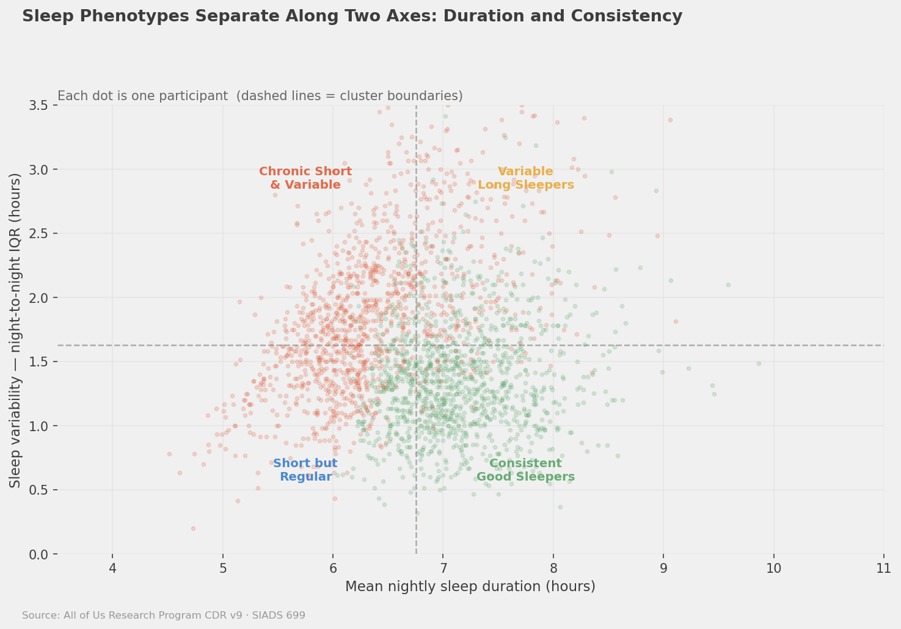

# SIADS 699 — Interim Findings Report
**Team Sleep Deprived | July 2026 — Phase 2 Update**

---

## 1. Cohort

| Metric | Value |
|--------|-------|
| Participants | **59,757** |
| Data source | All of Us CDR v9 (C2025Q4R6) |
| Sleep data | Fitbit `sleep_daily_summary` — main sleep, ≥4 nights, 4–12 hrs |
| Features | Sleep, activity, demographics, BMI, resting HR, SES, self-rated health |

**Demographics:** Mean age 56.9 (SD 16.2) · Female 66.3% · White 70.4% · UBR 19.6%

---

## 2. Key Sleep Statistics

| Metric | Value |
|--------|-------|
| Mean sleep duration | **6.79 hrs** |
| Nights < 6 hrs (avg per participant) | **30%** |
| Sleep consistency (IQR) | ~1.3 hrs |
| Mean daily steps | 6,852/day |

---

## 3. Model Performance

### Phase 1 (baseline features)
| Model | Duration R² | Consistency R² |
|-------|:-----------:|:--------------:|
| Ridge | 0.071 | 0.136 |
| Lasso | 0.070 | 0.127 |
| Random Forest | 0.085 | 0.159 |

### Phase 2 (+ resting HR, SES, self-rated health)
| Model | Duration R² | Consistency R² |
|-------|:-----------:|:--------------:|
| ElasticNet | 0.080 | 0.152 |
| Random Forest | 0.086 | 0.157 |
| **HistGBM** | **0.099** | **0.184** |

**+16% relative improvement** on both targets from richer features. Low absolute R² is expected — sleep has high unmeasured variance (genetics, stress, medications).

---

## 4. Key Findings

### Sleep duration drivers
1. **BMI** (0.162) and **female gender** (0.150) — biological factors dominate
2. **Nights tracked** (0.181) — a proxy for Fitbit engagement, partly methodological

### Sleep consistency drivers
1. **Age × daily steps interaction** (0.442) — by far the dominant factor. The relationship between physical activity and sleep regularity is strongly moderated by age. Older active adults sleep most consistently.
2. **Step variability** (0.109) — irregular activity → irregular sleep
3. **Self-rated health** (0.097) — perceived health status predicts sleep regularity better than duration

---

## 5. Sleep Phenotypes (KMeans, k=4)

| Cluster | N | Sleep | IQR | Short nights | Steps |
|---------|:-:|:-----:|:---:|:---:|:-----:|
| Consistent Good Sleepers | 25,176 (42%) | 7.12 hrs | 1.21 | 14% | 7,549 |
| Chronic Short & Variable | 14,479 (24%) | 6.68 hrs | 2.16 | 36% | 6,047 |
| Short but Regular | 14,467 (24%) | 5.92 hrs | 1.43 | 55% | 7,058 |
| Variable Long Sleepers | 5,635 (9%) | 7.88 hrs | 2.38 | 16% | 5,278 |

---

## 6. Fairness

| Subgroup | N | Duration R² |
|----------|:-:|:-----------:|
| White | 37,879 | 0.125 |
| **UBR** | **11,695** | **0.075** |
| Age 18–40 | 10,431 | 0.187 |
| Age 61–80 | 22,409 | 0.109 |

**40% relative accuracy gap for UBR participants.** Model performs systematically worse for underrepresented groups — a structural fairness concern.

---

## 7. Limitations

1. Cross-sectional design — no causal claims
2. Fitbit wearers are self-selected (healthier, higher SES)
3. 40% fairness gap for UBR populations
4. Survey concept IDs for smoking/alcohol returned unreliable data — excluded
5. Participant-level aggregation masks night-to-night dynamics

---

*All statistics are aggregated. No individual-level data exported from Workbench.*
